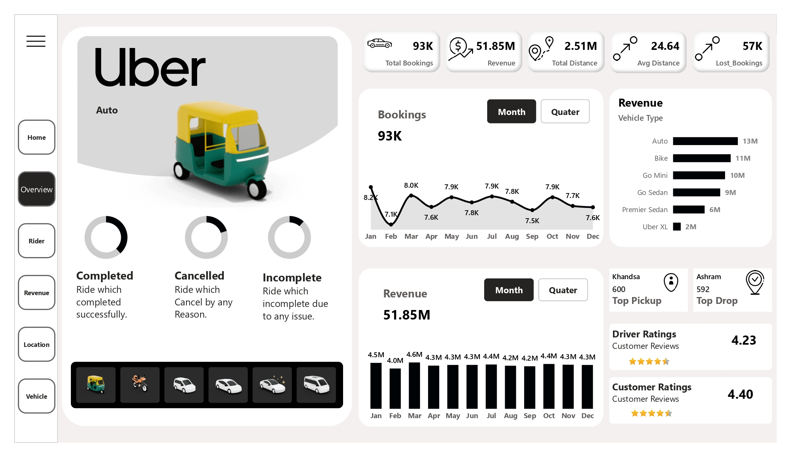
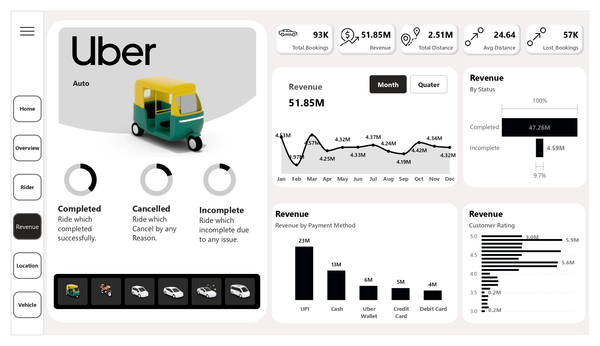
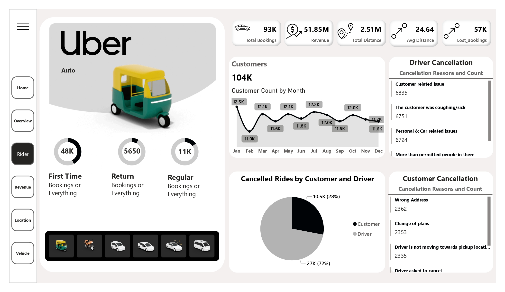
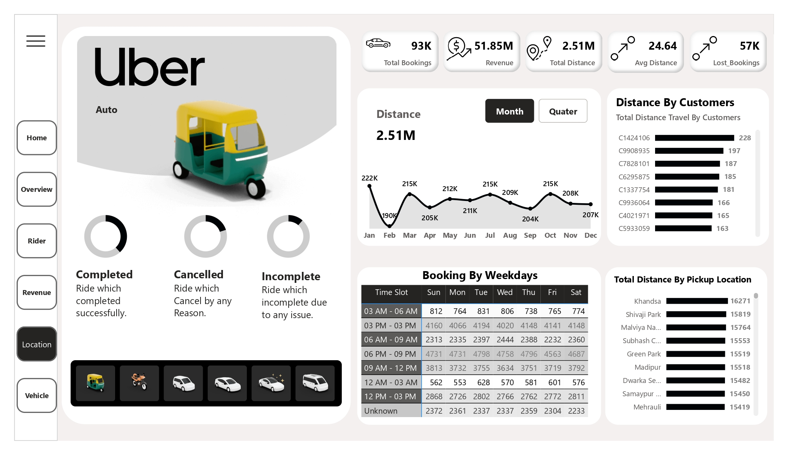
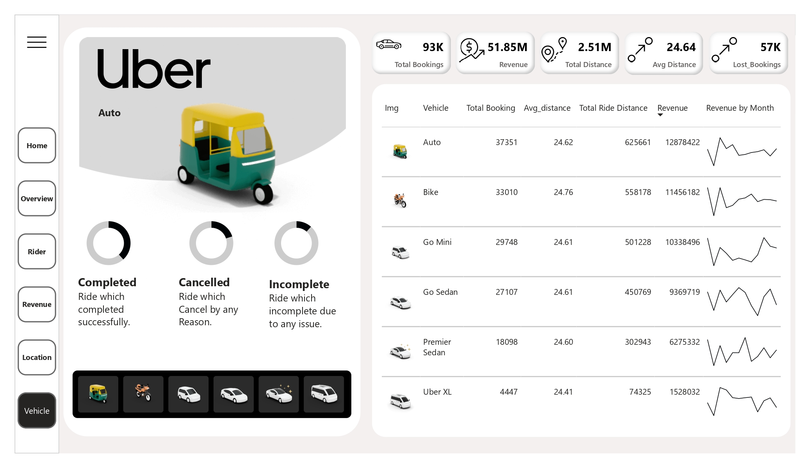

# 🚖 Uber Data Analytics Project Using Power BI

---

## 📌 Project Overview
This project focuses on analyzing **Uber ride data** and presenting insights through **interactive Power BI dashboards**.  
It enables stakeholders to monitor bookings, revenue, customer behavior, cancellations, and operational efficiency using data-driven analytics.

---

## 🎯 Objectives
- Monitor key performance indicators (KPIs)
- Analyze booking and revenue trends
- Identify customer and driver cancellation reasons
- Study peak hours and high-demand locations
- Evaluate vehicle-wise performance
- Support data-driven business decisions

---

## 🛠️ Tools & Technologies
| Tool | Purpose |
|------|---------|
| Power BI Desktop | Dashboard creation |
| Power Query | Data cleaning & transformation |
| DAX | Measures & calculations |
| Microsoft Excel | Dataset handling |
| Git & GitHub | Version control |

---

## 🧠 System Workflow
Raw Data → Data Cleaning → Data Modeling → DAX Measures → Power BI Dashboards → Business Insights

---

## 📊 Dashboards Included
- **Overview Dashboard** – KPIs, bookings, revenue, distance
- **Rider Analysis** – Customer behavior & cancellations
- **Revenue Analysis** – Payment methods and revenue trends
- **Location Analysis** – Pickup and drop location insights
- **Vehicle Analysis** – Vehicle-wise performance

---

## 🖼️ Dashboard Screenshots

### 📍 Overview Dashboard

### 💰 Revenue Analysis

### 🚖 Rider & Cancellation Analysis

### 📍 Location Analysis

### 🚗 Vehicle Performance

---

## 📁 Dataset Description
The dataset contains the following attributes:
- Booking status (Completed, Cancelled, Incomplete)
- Trip distance and revenue
- Vehicle type
- Payment methods
- Pickup and drop locations
- Customer and driver ratings
- Cancellation reasons

> ⚠️ The dataset is used only for **educational and internship purposes**.

---

## 📈 Key Insights & Results
- Identified peak booking hours and busy weekdays
- Analyzed revenue contribution by vehicle type
- Discovered major customer and driver cancellation reasons
- Improved visibility into operational inefficiencies
- Enabled faster decision-making with interactive dashboards

---

## 🏁 Conclusion
This project demonstrates how **Power BI transforms raw data into actionable insights** through effective data modeling and visualization.  
It highlights the importance of analytics in improving operational performance and customer experience.

---

## 👤 Author
**Sonu Kumar**  
📊 Aspiring Data Analyst

🔗 GitHub: https://github.com/SonuKumarAnalyst

---

## ⭐ Support
If you find this project useful:
- Give this repository a **star**
- Share your feedback
- Connect with me on GitHub

---

## ⚠️ Disclaimer
This project is created for **learning, academic, and internship purposes only**.  
It does not represent real Uber business data.
